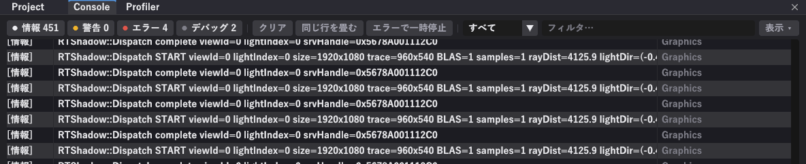

# コンソール



ログとエラーが出ます。**スクリプトのエラーもここです。**

## 上のボタン

| もの | 働き |
|---|---|
| **情報 / 警告 / エラー / デバッグ** の数字 | 押すとその種類だけに絞る（もう一度押すと戻る） |
| **クリア** | 今までのログを消す |
| **同じ行を畳む** | 毎フレーム出る同じログを 1 行にまとめ、右に回数を出す |
| **エラーで一時停止** | エラーが出た瞬間に再生を止める |
| **すべて ▼** | カテゴリ（Script / Graphics / Audio など）で絞る |
| **フィルタ…** | 入れた文字を含む行だけ出す |
| **表示 ▼** | 表示する列などの設定 |

!!! tip "ログが流れて読めないときは"
    グラフィックスのログが毎フレーム出るので、スクリプトのログはすぐ流れます。次のどちらかで見てください。

    - カテゴリを **Script** に絞る
    - **同じ行を畳む**を入れる

## エラーからコードへ飛ぶ

エラーの行を**ダブルクリック**すると、**VS Code がその行を開きます。**

行の右端にもリンクが出ます。

## スクリプトからログを出す

```cpp
Log("ふつうのログ");
Warn("気になること");
Error("まずいこと");
```

数値も `+` でつなげられます。

```cpp
Log("HP: " + hp + " / " + maxHp);
Log("位置: " + owner.transform.position.x);
Log("接地: " + controller.grounded);
```

!!! warning "毎フレーム Log を呼ばないこと"
    `Update` の中で条件なしに `Log` を書くと、1 秒に 60 行出ます。あっという間に読めなくなり、動作も重くなります。

    ```cpp
    // 良い例：変わったときだけ
    if (hp != lastHp_) {
        Log("HP: " + hp);
        lastHp_ = hp;
    }
    ```

    どうしても毎フレーム見たいときは **同じ行を畳む**を入れてください。

## 下のコマンド欄

コンソールの下にある `>` の欄から、**CVar（設定値）を直接読み書き**できます。再生中に値を変えて効果を確かめるのに使います。

## 画面の印

| 場所 | 出るもの |
|---|---|
| 右上 | `Script ✓ 10 型` … コンパイル成功と、使える型の数 |
| 右上（失敗時） |  |
| 右下 | `Script OK` / `Script 失敗` |
| 左下 | FPS・CPU 時間・GPU 時間 |

**赤くなったらスクリプトが壊れています。** → [エラーの直し方](../script/errors.md)
