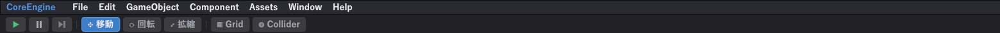

# ギズモとカメラ

## ギズモ（オブジェクトを動かす矢印）

オブジェクトを選ぶと、Game ビューに矢印が出ます。掴んで引っぱると動きます。



| モード | キー | 見た目 |
|---|---|---|
| **移動** | <kbd>W</kbd> | 3 本の矢印 |
| **回転** | <kbd>E</kbd> | 3 つの輪 |
| **拡縮** | <kbd>R</kbd> | 3 本の四角い棒 |

色は軸に対応しています。**赤 = X、緑 = Y、青 = Z** です。

- **矢印 1 本**を掴むとその軸だけ動きます
- **中心の四角**を掴むと画面に平行に動きます

!!! tip "細かい値はインスペクタで"
    ギズモは大まかに置くためのものです。`(0, 5, 0)` のようにきっちり入れたいときは、インスペクタの `Transform` に直接打ち込みます。

### ツールバーの他のボタン

| ボタン | 意味 |
|---|---|
| **Grid** | 床のグリッドを出す／消す |
| **Collider** | **コライダーの形を線で表示する** |

!!! tip "当たり判定が合わないときは Collider を押す"
    見た目とコライダーはまったく別物です。「当たらない」「変なところで当たる」と思ったら、まず **Collider** を押して形を目で見てください。だいたいこれで分かります。

---

## カメラを動かす

Game ビューの上にカーソルを置いた状態で操作します。

| 操作 | やり方 |
|---|---|
| **回す（対象の周りを回る）** | 中ボタンドラッグ |
| **平行移動** | <kbd>Shift</kbd> + 中ボタンドラッグ |
| **寄る・引く** | ホイール |
| **視点を回す（その場で向きだけ）** | 右ボタンドラッグ |
| **前後左右へ飛ぶ** | <kbd>W</kbd><kbd>A</kbd><kbd>S</kbd><kbd>D</kbd> |
| **上下へ飛ぶ** | <kbd>Q</kbd>（下） <kbd>E</kbd>（上） |
| **速く飛ぶ** | <kbd>Shift</kbd> を足す |
| **選んだものへ寄る** | <kbd>F</kbd> |

!!! warning "W / E / R はギズモと共用です"
    オブジェクトを選んでいるときの <kbd>W</kbd><kbd>E</kbd><kbd>R</kbd> は**ギズモの切り替え**、右ドラッグでカメラを動かしている間の <kbd>W</kbd> は**前進**です。押しても動かないと思ったら、右ドラッグしているか確かめてください。

    割り当ては **Help → キー操作を見る**で変えられます。

### 迷子になったら

<kbd>F</kbd> を押してください。選んでいるオブジェクトの前にカメラが戻ります。何も選んでいなければ、適当なオブジェクトを選んでから押します。

---

## ゲーム用のカメラとエディタのカメラ

**2 つは別物です。**

| | エディタのカメラ | ゲームのカメラ |
|---|---|---|
| 何 | 編集中に見回すためのもの | 実際にゲームで映るもの |
| 実体 | シーンに置かれていない | `Camera` コンポーネントを持ったオブジェクト |
| 動かし方 | 上のマウス操作 | `Transform` を動かす（スクリプトから） |

再生すると、`Camera` の **メインカメラ**にチェックが入っているオブジェクトの映像になります。

!!! warning "ゲームのカメラを動かすときは、オブジェクトの Transform を動かします"
    `Camera` コンポーネント側に位置はありません。**カメラのオブジェクトの `Transform`** を動かしてください。

```cpp
// プレイヤーの後ろを付いていくカメラ
void LateUpdate()
{
    if (target is null) { return; }
    Vector3 want = target.transform.position + offset;
    owner.transform.position = want;
}
```

`LateUpdate` で動かすのが大事です。`Update` だとプレイヤーが動く前のフレームを追いかけて、1 フレーム遅れてガタつきます。
