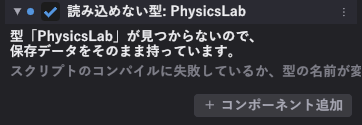

# エラーの直し方

## 壊れたことに気づく

右上の印が**赤**になります。


同時に、

- Console の **エラー**の数が増えます
- 右下が `Script 失敗` になります
- 直したスクリプトのコンポーネントが **「読み込めない型」**になります

## エラーを読む

Console を開き、**エラー**の数字を押して絞り込みます。

```
PhysicsTestScene/_BrokenSample.as(9, 14) : Can't implicitly convert from 'const string' to 'int&'.
スクリプトのコンパイルに失敗しました（12 ファイル）
```

| 部分 | 意味 |
|---|---|
| `_BrokenSample.as` | **どのファイルか** |
| `(9, 14)` | **9 行目の 14 文字目** |
| 残り | 何が悪いか |

**その行をダブルクリックすると、VS Code がその行を開きます。**

## 1 つ壊れても、他は止まりません

<div class="figure" markdown="0">
--8<-- "assets/figures/script-fallback.svg"
</div>

書きかけの 1 ファイルのために、他の作業まで巻き戻ることはありません。警告にこう出ます。

```
A.as は直す前の版のまま動いています（このファイルのエラーを直すと入れ替わります）
```

!!! info "効かない場合もあります"
    戻したファイルのクラスを**他のファイルが新しい形で使っている**ときは、2 回目も失敗します（`A` に足したばかりのメンバを `B` が呼んでいる、など）。そのときは全体が前の状態のままになります。

    起動して最初のコンパイル（戻せる版が無い）も同じです。

## 「読み込めない型」と出たら



**保存したデータはそのまま持っています。** 消さないでください。

| 原因 | 直し方 |
|---|---|
| コンパイルに失敗している | エラーを直す |
| クラス名を変えた | 名前を戻すか、シーンの JSON の `type` を新しい名前に直す |
| ファイルを消した | 戻すか、コンポーネントを外す |

## よく出るエラー

### `Can't implicitly convert from 'X' to 'Y'`

型が合っていません。

```cpp
int hp = "100";          // 文字列は整数に入らない
float f = someInt;       // これは通る（int → float）
int i = someFloat;       // これは通らない（float → int は明示が要る）
int i = int(someFloat);  // こう書く
```

### `'X' is not a member of 'Y'`

その名前のメンバがありません。**綴りを確かめてください。**

型名の先頭を小文字にした名前で引きます。`UISlider` なら `owner.uiSlider` です。

### `No matching signatures to 'X'`

引数の数か型が合っていません。→ [スクリプト API](../reference/script-api.md)

### `Name conflict. 'X' is a class`

**同じクラス名が 2 つあります。** `.as` は全部まとめてコンパイルされるので、クラス名はプロジェクト全体で一意である必要があります。

**ファイル名とクラス名を揃えておけば**、ファイル名は重複しないので起きません。

### `Null pointer access`（実行中に出る）

`null` のハンドルを触りました。

```cpp
// 悪い
owner.rigidbody.AddForce(force);

// 良い
Rigidbody@ body = owner.rigidbody;
if (body !is null) { body.AddForce(force); }
```

`Awake` で他のコンポーネントを取ろうとしたときによく出ます。**`Start` に移してください。**

---

## エラーは出ないが動かないとき

| 症状 | まず疑うところ |
|---|---|
| `Update` が呼ばれない | **停止中です。** ▶ を押す |
| `Update` が呼ばれない（再生中） | コンポーネントのチェックが外れている |
| 当たり判定が来ない | ツールバーの **Collider** で形を見る。トリガーのチェックを確かめる |
| 入力が効かない | UI にフォーカスが残っている（`UI::ClearFocus()`） |
| 値が反映されない | **コードの初期値ではなく、シーンに保存された値が使われています** |
| 動きがカクつく | `Update` で物理を触っている。`FixedUpdate` へ移す |
| カメラが 1 フレーム遅れる | `Update` で追従している。`LateUpdate` へ移す |
| Tween が動かなくなった | スクリプトを読み直した。`OnScriptReloaded()` で渡し直す |

## 調べ方

**`Log` を挟むのがいちばん早いです。**

```cpp
void Start()
{
    Log("Start が呼ばれた");
    @body_ = owner.rigidbody;
    Log("rigidbody: " + (body_ is null ? "取れなかった" : "取れた"));
}
```

**エラーで一時停止**を入れておくと、エラーが出た瞬間に止まるので、その時点の画面を見られます。

!!! tip "止まっている間もインスペクタは動きます"
    一時停止して、インスペクタで値を見たり変えたりできます。「この変数、本当にその値になってる？」を確かめるのに使ってください。
