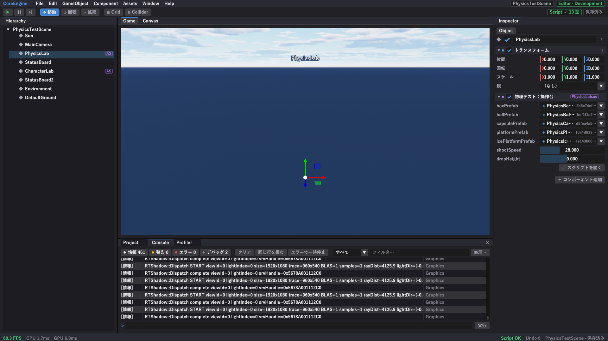
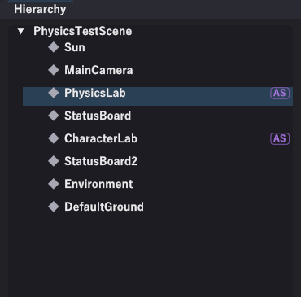
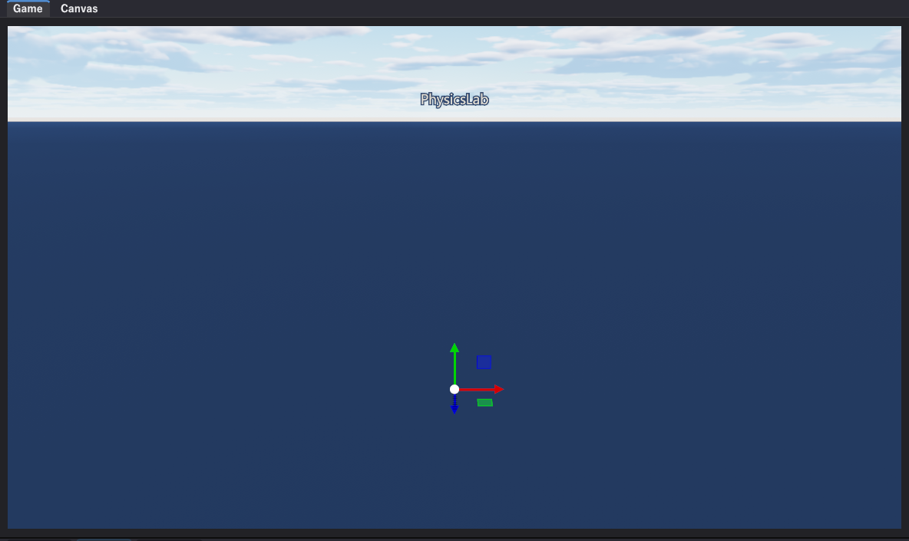
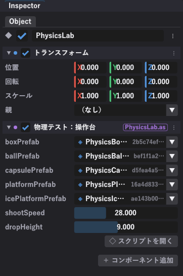
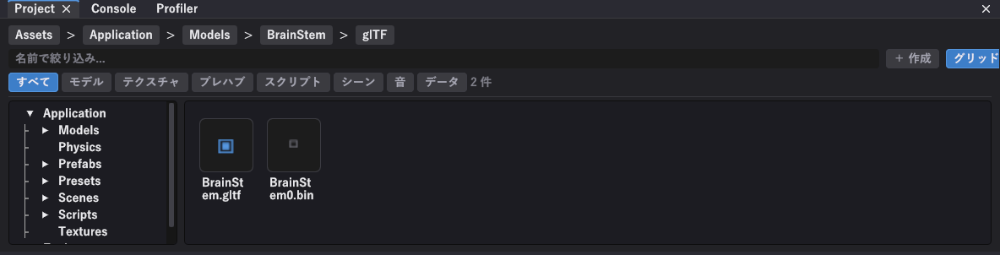

# エディタの画面

画面は 5 つに分かれています。

--8<-- "assets/figures/editor-layout.svg"

---

## ヒエラルキー（左）

シーンに置いてあるものが全部並びます。いちばん上がシーンの名前です。

- **クリック**で選ぶ（インスペクタに中身が出ます）
- **▶ / ▼** で親子を開け閉め
- 右端の **AS** の印は、そのオブジェクトにスクリプトが付いていることを表します
- 選んだ状態で <kbd>F</kbd> を押すと、カメラがそのオブジェクトへ寄ります

親子関係があるものは入れ子で並びます。子を選ぶと親が自動で開くので、探し回らなくて済みます。

---

## Game / Canvas（中央）

- **Game** … 3D の画面。ここでオブジェクトを選んだり動かしたりします
- **Canvas** … UI だけを平面で見る画面。UI の配置はこちらが楽です

真ん中に出ている矢印が **ギズモ**です。掴んで引っぱるとオブジェクトが動きます。→ [ギズモとカメラ](../editor/gizmo-camera.md)

---

## インスペクタ（右）

選んだオブジェクトの中身が出ます。上から順に、

1. **Object** … 名前と、有効・無効のチェック
2. **付いているコンポーネント** … 上の例では「トランスフォーム」と「物理テスト：操作台」（スクリプト）
3. **＋ コンポーネント追加** … 新しいコンポーネントを足す

スクリプトのコンポーネントには、右上に **ファイル名の印**（`PhysicsLab.as`）が出ます。**「スクリプトを開く」**を押すと VS Code でそのファイルが開きます。

---

## Project（下）

アセット（モデル・テクスチャ・プレハブ・スクリプト・シーン・音）を置いてあるフォルダの中身です。

- 上のパンくず（`Assets > Application > Models > …`）で場所が分かります
- **すべて / モデル / テクスチャ / プレハブ / スクリプト / シーン / 音 / データ** で種類を絞れます
- **＋ 作成** から、フォルダとスクリプトを作れます
- モデルを **Game ビューへドラッグ**すると、そのモデルのオブジェクトができます

→ [Project とアセット](../editor/project-assets.md)

---

## Console（下）

ログとエラーが出ます。**スクリプトのエラーもここに出ます。**

- 上の **情報 / 警告 / エラー / デバッグ** の数字を押すと、その種類だけに絞れます
- **フィルタ…** に文字を入れると、その文字を含む行だけになります
- **同じ行を畳む**で、毎フレーム出る同じログを 1 行にまとめられます
- **エラーで一時停止**を入れておくと、エラーが出た瞬間に再生が止まります
- エラーの行を**ダブルクリック**すると、VS Code でその行が開きます

→ [コンソール](../editor/console.md)

---

## メニュー

| メニュー | 主な中身 |
|---|---|
| **File** | シーンを保存 / 新しいシーン / シーンを開く / 再読み込み / スクリーンショット / 終了 |
| **Edit** | Project Settings |
| **GameObject** | 空のオブジェクトを作成 / エフェクト / UI / 複製 / 削除 |
| **Component** | 選んでいるものへコンポーネントを足す |
| **Assets** | スクリプトを再読み込み |
| **Window** | 各パネルの表示・非表示、レイアウト、全画面 |
| **Help** | キー操作を見る / バージョン情報 |

!!! tip "パネルを閉じてしまったら"
    **Window** メニューから出し直せます。レイアウトが崩れたら **Window → Layout → レイアウトを初期化**です。

---

## 画面の右上と右下

- 右上の **シーン名**と **Editor・Development** の印で、今どのシーンをどの構成で開いているか分かります
- その下の **Script ✓ 10 型** は、スクリプトが正常にコンパイルできていて、10 個のコンポーネント型が使えることを表します。失敗すると赤くなります
- 右下にも **Script OK / Undo の回数 / シーン名・保存済み**が出ます
- 左下は **FPS・CPU 時間・GPU 時間**です
